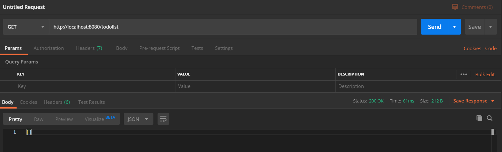

# Crash Course: Front End Development

## Understanding MV* Application Architecture


In general, it's hard to maintain a non-modular codebase.
We accomplish this more easily by decoupling the ***model*** and the ***view*** We'll cover the **"\*"** in the backend section.

### The Model

The model is responsible for the content found on a page of a web app.  It processes backend requests to fetch page data, and processes the data as necessary.  It feeds raw data to the view, without any information on how it should be displayed.

### The View

The view handles the presentation of the page.  It doesn't care what's being displayed, but it needs to look good.  It needs some interface to interact with the model so that it can retrieve the data.  There are many different approaches to this, some of which will be discussed later.

### Vue Basics

At the heart of it all, Vue is just an extension to standard HTML and CSS. You need to
include the Vue source in the HTML header, and that's pretty much it. Here's a fully functioning Vue app:

```html
<!DOCTYPE html>
<html>
  <head>
    <title>My first Vue app</title>
    <script src="https://unpkg.com/vue"></script>
  </head>
  <body>
    <div id="app">
        <h1> Magic Stuff: {{ stuff }} </h1>
        <input v-model="stuff" />
    </div>
    <script>
      var app = new Vue({
        el: "#app",
        data: {
          stuff: "This is a fully functional Vue app.",
        },
        methods: {

        },
      });
    </script>
  </body>
</html>
```

The entire app consists of a `<script>` section with a *Vue instance*, which maintains the *model*, and the `<div id="app">` section which maintains the *view*.
The main idea behind Vue (and other JS frameworks) is the concept of binding the data from the model to elements in the view, without
them needing to know about each other.

The Vue instance consists of three fundamental parts:

- `el`: this is the id of the element that will have access to the model provided via the Vue instance.
- `data`: this is an object that holds the items that are accessible to be used or modified in the `#app` section.
- `methods`: this is blank for now, but it's one of our most important sections. We use this to define more complex operations using our data. All of the objects in this section are simply Javascript functions of the form `function() {...}`.

Let's see how this works; in the `input` field, the contents of `stuff` are displayed. If we change the contents of `stuff` in the view, notice that the contents of the `<h1>` tags are dynamically updated.  Similarly, if we manually set `app.stuff = "newStuff"` from the console, the view updates automatically as well.  This is known as *two way binding*.

Let's add some more to this and see what it can accomplish.

We can declare a new *Component* which is essentially a predefined view template. For example, let's make one that shows todo list items.

```js
Vue.component("todo-list-item", {
  props: ["todo"],
  template: "<li>{{todo.text}}</li>"
});
```

In this component, we have:

- `props`: these are like the arguments to a function. We use these to construct a component
- `template`: this is literally valid html that will display a prop the same way every time

In this context, we're just displaying the text of each item in the todo list wrapped inside of a list element. We can include this component as valid HTML syntax with the tags `<todo-list-item></todo-list-item>`. To use the component, we can try something like this:

```html
<!DOCTYPE html>
<html>
  <head>
    <title>My first Vue app</title>
    <script src="https://unpkg.com/vue"></script>
  </head>
  <body>
    <div id="app">
      <strong>Grocery List:</strong>
      <ol>
        <todo-list-item
          v-for="item in list"
          v-bind:todo="item"
          v-bind:key="item.id"
        ></todo-list-item>
      </ol>
    </div>

    <script>
      Vue.component("todo-list-item", {
        props: ["todo"],
        template: "<li>{{todo.text}}</li>"
      });
      var app = new Vue({
        el: "#app",
        data: {
          currentItem: "",
          list: [
              {id: 0, text: "Eggs"},
              {id: 1, text: "Milk"},
          ]
        },
        methods: {
        }
      });
    </script>
  </body>
</html>
```

Now, we're able to display the elements of our shopping list (in our app data), but we can't update them.  That's where we'll use `methods`.

Let's make a function called `addItem` and `removeItem` so that we can use this like a real list.

```js
methods: {
    addItem: function() {
        this.list.push({ id: this.list.length, text: this.currentItem });
        this.currentItem = "";
    },
    removeItem: function() {
        this.list.pop();
    }
}
```

As you'd expect, these functions will push (add) the current item (bound to the input box) to the list, or pop (remove) the last item from the list when called. We can call a method by binding it to some kind of event.  We'll do this with a button, like this:

```html
<div>
    <input v-model="currentItem" />
    <button v-on:click="addItem">Add item</button>
    <button v-on:click="removeItem">Remove Item</button>
</div>
```

To manipulate HTML using data from our model, we use *Vue Directives*:

- `v-model` speciifes a two way binding with an element of `app.data`. This means that any change to the item in the input box will be transferred to the model, and any change to the model will trigger an update of the view.
- `v-on:` specifies a function or action to be called when some event occurs. In this case, we're performing it on click. We can can listen for other events, such as `submit`, `hover`, or other modifications of these actions, e.g. `click.stop`, `click.once`, `click.self`, etc. In this case, we're just making our button trigger adding or removing the current item, as specified by our input box.

```html
<!DOCTYPE html>
<html>
  <head>
    <title>My first Vue app</title>
    <script src="https://unpkg.com/vue"></script>
  </head>
  <body>
    <div id="app">
      <strong>Grocery List:</strong>
      <div>
        <input v-model="currentItem" />
        <button v-on:click="addItem">Add item</button>
        <button v-on:click="removeItem">Remove Item</button>
      </div>
      <ol>
        <todo-list-item
          v-for="item in list"
          v-bind:todo="item"
          v-bind:key="item.id"
        ></todo-list-item>
      </ol>
    </div>

    <script>
      Vue.component("todo-list-item", {
        props: ["todo"],
        template: "<li>{{todo.text}}</li>"
      });
      var app = new Vue({
        el: "#app",
        data: {
          currentItem: "",
          list: [
            { id: 0, text: "Veggies" },
            { id: 1, text: "Cheese" },
            { id: 2, text: "Milk" }
          ]
        },
        methods: {
          addItem: function() {
            this.list.push({ id: this.list.length, text: this.currentItem });
            this.currentItem = "";
          },
          removeItem: function() {
            this.list.pop();
          }
        }
      });
    </script>
  </body>
</html>
```

This is effectively the entire process. We could add `<style>` tags with CSS to style our components like standard HTML.  For now, they'll stay ugly. Sue me. Next, we'll dive into the backend, where we'll let our data persist in a database with a web service, and then come back to integrate it with a UI, made with proper tooling.

# Crash Course: Back End Development
## The "\*" of MV* Architecture

While the model and the view organize and present the data for the frontend, the **"\*"**, most commonly the ***Controller***, is what manages the data and processing for the backend. This architecture is referred to as ***MVC***. There are other options, but the controller is probably the simplest, and most common.

## Controller

The controller is responsible for handling the application logic, taking input from the view, processing it, and updating the model, which then updates the view.

## REST APIs

The controller is the face of backend, and runs remotely on a server. The frontend, however, is viewed on a client's computer, separate from the backend. How the client and the server interact with each other is called the **REST API**.

The REST API is the API that other internet applications use to interact with your application. REST API calls come in the form of URLs. When you go to a website like `https://mywebsite.com/home` what you're doing is making an API call to the `mywesbite.com` server and telling it that you want to access whatever file or information is located at the `/home` endpoint. In a minute we'll see more about what a accessing a controller endpoint means.


## Building a Back End

We're going to build a backend REST API using **Node.js**. Our application will receive input from the client through our API, handle it, and then respond to the client.

You'll need to install node.js from [https://nodejs.org/en/](https://nodejs.org/en/), or using your package manager of choice.

### Setting up the Project

Open up a terminal and navigate to the directory that you want to build your project in.
Type:

```bash
> mkdir dsc-crash-course
> cd dsc-crash-course
> npm init
```

Change the data as you see fit. This will become your `package.json` file.

Now we are going to install our back end framework **ExpressJs**. ExpressJs provides us a selection of functions we can use to build a REST API. We'll see these function later.

In your terminal type:

```bash
> npm install express --save
```

Lastly, we want to install our database. For ease of use we'll be using `sqlite`, a lightweight database contained in a C program. Sqlite allows us to use a SQL database without having to use a separate application. Typically you would download, install, and configure a SQL database application like PostgreSQL, MySQL, MSSQL, Oracle SQL, etc. One of these applications would give you a fully-featured SQL database with a good GUI, built-in security, lots of memory, better scalability, and more flexibility. However, our application is small and simple. We are prioritizing simplicity over robustness, so sqlite is appropriate here.

If you decide that you'd rather use a full-featured database like one of those listed above, the transition should be fairly simple. The way that we use sqlite in our application is similar to other databases. More on this later.

Type:
```
> npm install sqlite3
```

Once it's downloaded with no errors, we can finally get to building the application.

### Building the Application

Now we want to create our main application file: `index.js`. Somewhat similar to how a java application will run the

```java
public static void main (String[] args){
  . . .
}
```

method when it runs, our Node.js application will run `index.js`. Here, we will define all of the configurations for our back end.

Go into your index.js file and add:

```js
// Import express
const express = require('express')
// Initialize the app
const app = express();
//Use to parse JSON request bodies
app.use(express.json());
//Parse URL-encoded bodies
app.use(express.urlencoded({extended : true}));
// Setup server port
var port = process.env.PORT || 3000;
// Send message for default URL
app.get('/', (req, res) => res.send('Hello World with Express'));
// Launch app to listen to specified port
app.listen(port, function () {
     console.log("Running dsc-crash-course on port " + port);
});
```

Here we import Express, initialize the app, and tell our app to listen to that port.

The most important part here, though, is:

```js
app.get('/', (req, res) => res.send('Hello World with Express'));
```

This line defines our first **REST API endpoint**, the door from the internet to our application. What it says is that we want to define a `GET` endpoint, and in response we want to send the phrase "Hello World with Express".

Save, and run ```node index``` in your terminal. You should see:
`"Running dsc-crash-course on port 3000"`

Now, if you open a browser and go to: `http://localhost:3000`, you should see `"Hello World with Express"`

### Restructuring the App

Now, although you could write your entire API in this one file, we picked the MVC architecture for the benefit of logical code separation. And if we're going to define a bunch of logic for how our API handles inputs, we probably shouldn't do it in the same file that configures our app for us. We want our code to be clear and easy to refactor.

So go ahead and create a `controller.js` file and open it. Here, we're going to redefine our `get endpoint` that we defined in the index.js file.

Add to your controller:
```js
// Initialize express router
const router = require('express');

//Define default API response
router.get(
    '/',
    //Define function to handle request
    (req, res) => {
        //Return the 200 (OK) status, and a JSON object
        res.status(200).json({
            status: 'API is Working',
            message: 'Welcome to the dsc-crash-course page',
        });
    },
);

//Export the router methods
module.exports = router;
```

Lastly, we want to go back into our `index.js` file, add the line:

```js
//Import controller
const controller = require("./controller")
```

and replace:

```js
// Send message for default URL
app.get('/', (req, res) => res.send('Hello World with Express'));
```

with:

```js
//Route "/" endpoint to the controller
app.use('/', controller);
```

Here we're just telling our index.js file to route all requests at the default "/" endpoint to the endpoints that we define in the controller. </br></br>
Your index.js file should now look like:

```js
// Import express
const express = require('express')
//Import controller
const controller = require("./controller")
// Initialize the app
const app = express();
//Use to parse JSON request bodies
app.use(express.json());
//Parse URL-encoded bodies
app.use(express.urlencoded());
// Setup server port
var port = process.env.PORT || 3000;
//Route "/" endpoint to the controller
app.use('/', controller);
// Launch app to listen to specified port
app.listen(port, function () {
     console.log("Running dsc-crash-course on port " + port);
});
```

Now, if we run `node index` in the terminal again and return to our browser at `localhost:3000`, we should see the json that we defined in our controller: `{"status":"API is Working","message":"Welcome to the dsc-crash-course page"}`


### Using the Database

Now, we want the ability to store our data, and for this we need to use our `sqlite` database. Typically, we would make another file to define the database access functions (often called the service layer), but for simplicity, we're going to handle both the API requests and access the database in our controller.

At the top of your `controller.js` file (after the router import) add the following code to create and connect to the database:

```js
//Import sqlite module
const sqlite3 = require('sqlite3').verbose();
//Initialize database and open a connection
//Define the db to be created in memory and error check
let db = new sqlite3.Database(':memory:', function(err) {
    if(err) {
        return console.error(err.message);
    }
    console.log('Connected to in memory SQlite database');
    //Create our table
    var initTablesQuery = 'CREATE TABLE todolist (id INT PRIMARY KEY NOT NULL, item CHAR(50))';
    db.run(initTablesQuery);
});
```

**Note:** Although the queries are in SQLite syntax and are similar to most SQL database queries, the methods for creating, connecting, and querying those databases will vary depending on which one you choose. `db.run`, `db.all`, etc are not universal. If you decide to use a different database you'll need to reference the documentation for that tool.

### Creating our Endpoints

Now, we're going to define a new endpoint: `GET: /todolist` which will retrieve all the items in our todolist. On our router, we can define any of the HTTP methods:  `GET`, `POST`, `PUT`, `DELETE`. The Express router has a predefined function for each of these methods. For our get method, we pass the api path that we want to associate with this endpoint, `/todolist`, and the callback function defining what we want to do when we get a request at this endpoint. To the `controller.js` file we'll add:

```js
//Define GET todolist endpoint
router.get('/todolist',
  //Function to handle request
  function (req, res) {
    //SQL query for todo list items
    const query = 'SELECT * FROM todolist';
    //Run query and process returned data
    db.all(query, [], function(err, todolist){
        if (err) {
            //If error, return error message
            res.status(500).json({
                error: err,
            });
            return console.log(err.message);
        }
        //Return the 200 (OK) status, and a JSON containing todolist
        res.status(200).json(todolist);
    });
});
```

If we were to run our app and try to access this endpoint at `localhost:3000/todolist`, we'd receive an empty list: `[]`. We need a way to add items to our list. We'll follow the format of the get method, but in our callback function we will run a query to insert the new item to our datatbase. Add the `POST /todolist` endpoint:

```js
//Define POST /todolist endpoint
router.post('/todolist',
  //Function to handle request
  function (req, res) {
    //Get request the item to add to the list
    var taskId = req.body.taskId;
    var task = req.body.task;
    //Insertion query
    const query = 'INSERT INTO todolist (id, item) VALUES(?)';
    //Insert new item into database
    db.run(query, [ taskId, task ], function(err, rows) {
        if (err) {
            res.status(500).json({
                error: err,
            });
            return console.log(err.message);
        }
        //Return the 201 (Created) status, and a JSON containing todolist
        res.status(200).json({
            message: 'Item added',
        });
    });
});
```

Lastly, we want to be able to remove items from our list. We'll copy the same format as our previous endpoints, but instead run a query to delete our item by id. Add:

```js
//Define DELETE /todolist endpoint the {itemNumber} parameter
router.delete(
    '/todolist/:itemId',
    //Function to handle request
    (req, res) => {
        //Get request the item id from the path parameters
        let itemId = req.params.itemId;
        //Delete query
        const query = 'DELETE FROM todolist WHERE id=?';
        //Delete item from database
        db.run(query, [ itemId ], function(err) {
            if (err) {
                res.status(500).json({
                    error: err,
                });
                return console.log(err.message);
            }
            //Return the 200 (OK) status, and the row of the deleted item
            res.status(200).json({
                message: `Item with id ${this.changes} deleted`,
            });
        });
    },
);
```

### Testing the Endpoints

Now, you are able to go into your browser at `localhost:3000/todolist` and get back an empty list of items. In order to add an item, we need to make a **POST** request, with a body containing a json defining the item we want to add.

For this, we will use Postman, which you can download here: https://www.postman.com/downloads/. Postman is a useful tool for sending API requests and testing your backend. Be sure to start up the back end server from the terminal before sending a request. Once Postman is installed and opened, make a new request, and enter `http://localhost:3000/todolist`. Then hit **Send**. It should look like this:</br></br>


Now, create another request, this time changing the method to **POST** and use the same URL to our endpoint. Click on Body, select raw, then from the dropdown menu on the right select JSON. Here enter:

```json
{
	"item" : "Buy groceries"
}
```

Click send. It should look like this:</br></br>


If you try the GET function again, it should return your "Buy groceries" item.

Lastly, let's test the delete function. Make a new request, change the method to **DELETE**, and use the same URL as the other two but add `/1` so you have `http://localhost:3000/todolist/1`.

Hit send. Then, go back to the `GET` request and send again. It should return an empty array.

Great! Now we can add items, retrieve, and delete them from our database all via the REST API. There's one more HTTP method we should implement, `PUT`, which would be used for updating an item, given its ID. But we'll leave that up to you. You could also try making an endpoint for adding items in bulk, or retriving an item by its id.

## Building a Front End: Vue Basics

Now that we have an API, we'll build a variation of the application demonstrated before.

### Installing Node.js and Vue.js

You'll need to install node.js from [https://nodejs.org/en/](https://nodejs.org/en/), or using your package manager of choice.  Once you've done that, install vue with `npm install -g @vue/cli`

### Creating a Project

We'll make a project called "todo-list" by running

```bash
# for now, keep the default project settings
vue create todo-list
cd todo-list
```

to create the Vue application and change into its directory. Inside this directory, you'll see some items like:

- `public/`
  - `index.html`
  - `assets/`
  - `components/`
- `src/`

We'll focus primarily on `src/`, since this is where our components and styles are kept.

### Replicating the Previous Code

